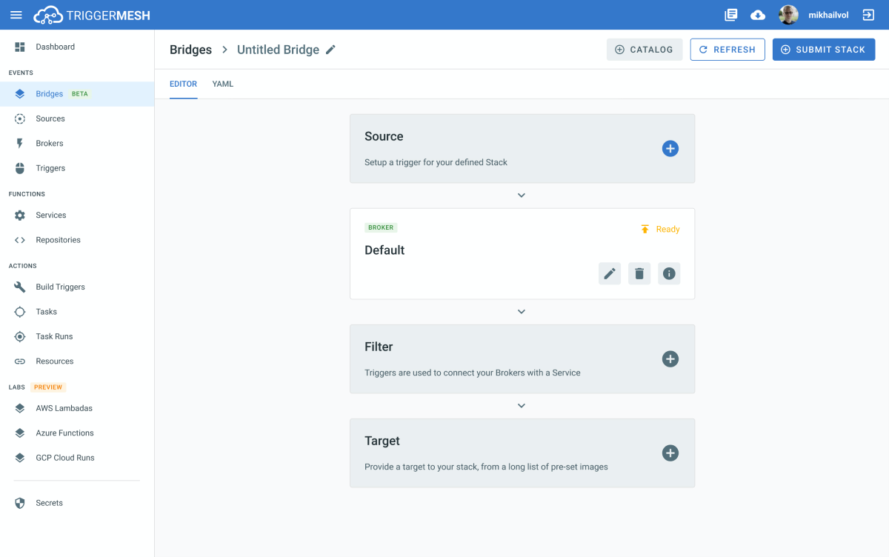

[](https://github.com/triggermesh/aws-event-sources/releases) [](https://github.com/triggermesh/aws-event-sources/releases) [](https://circleci.com/gh/triggermesh/aws-event-sources/tree/master) [](https://goreportcard.com/report/github.com/triggermesh/aws-event-sources) [](LICENSE)


TriggerMesh Sources for Amazon Web Services (SAWS) allows you to quickly and easily consume events from your AWS  services and send them to workloads running in your cluster.

## Installation

### Kubernetes

Using Helm:

```bash
$ helm repo add triggermesh https://storage.googleapis.com/triggermesh-charts
$ helm install triggermesh/aws-event-sources
```

Refer to the [aws-event-sources chart documentation](chart/README.md) for all available configuration options.

### OpenShift

Login to the OpenShift Container Platform console and install the **AWS Sources Operator** from the **OperatorHub**. Refer to the [aws-event-sources-operator documentation](https://github.com/triggermesh/aws-sources-operator/blob/master/README.md) for the complete guide in getting up and running on the OpenShift Container Platform.

## Getting Started

The following table lists the AWS services currently supported by TriggerMesh Sources for AWS and their support level.

|                            AWS Service                            |                  Documentation                   | Support Level |
|-------------------------------------------------------------------|--------------------------------------------------|---------------|
| [CodeCommit](https://aws.amazon.com/codecommit/)                  | [README](cmd/awscodecommitsource/README.md)      | alpha         |
| [Cognito Identity Pool](https://aws.amazon.com/cognito/)          | [README](cmd/awscognitoidentitysource/README.md) | alpha         |
| [Cognito User Pool](https://aws.amazon.com/cognito/)              | [README](cmd/awscognitouserpoolsource/README.md) | alpha         |
| [DynamoDB](https://aws.amazon.com/dynamodb/)                      | [README](cmd/awsdynamodbsource/README.md)        | alpha         |
| [Kinesis](https://aws.amazon.com/kinesis/)                        | [README](cmd/awskinesissource/README.md)         | alpha         |
| [Simple Notifications Service (SNS)](https://aws.amazon.com/sns/) | [README](cmd/awssnssource/README.md)             | alpha         |
| [Simple Queue Service (SQS)](https://aws.amazon.com/sqs/)         | [README](cmd/awssqssource/README.md)             | alpha         |

For detailed usage instructions about a particular source, please refer to the linked `README.md` files.

## TriggerMesh Cloud

These container sources can be used as is from this repository or you can use our feature rich [TriggerMesh Cloud](https://cloud.triggermesh.io) offering where you can use our easy to use interface to configure them and also have access to other event source that are not publicly available.



## Roadmap

* Add a more generic SNS source using an operator architecture
* Add a CloudWatch source using an operator architecture
* Performance improvements

## Support

The sources listed in this repository are fully open source and can be used in any Knative cluster. They consist of event consumers for various AWS services. Most of them are packaged as `Container Sources` and make use of [CloudEvents](https://cloudevents.io/).

We would love your feedback and ideas. Reach out to us by filing an [issue](https://github.com/triggermesh/aws-event-sources/issues/new) and help us extend and improve these sources with your [contributions](https://github.com/triggermesh/aws-event-sources/compare).

## Commercial Support

TriggerMesh Inc supports these sources commercially, email info@triggermesh.com for details.

## Code of Conduct

This repository is not a part of [CNCF](https://www.cncf.io/) but we abide by its [code of conduct](https://github.com/cncf/foundation/blob/master/code-of-conduct.md).

## Contributing

Refer to [DEVELOPMENT.md](./DEVELOPMENT.md).
