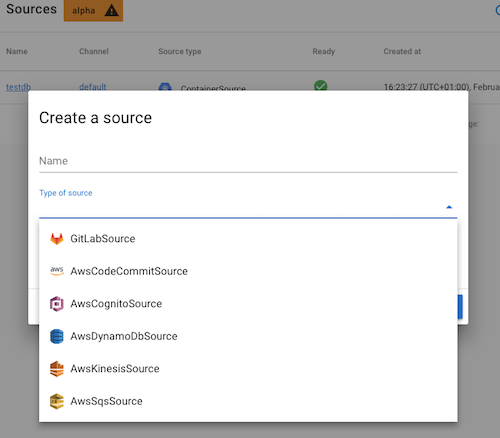

[](https://github.com/triggermesh/aws-event-sources/releases) [](https://github.com/triggermesh/aws-event-sources/releases) [](https://circleci.com/gh/triggermesh/aws-event-sources/tree/master) [](https://goreportcard.com/report/github.com/triggermesh/aws-event-sources) [](LICENSE)


**What:** Knative Lambda Sources (KLASS) are Knative event sources for AWS services.

**Why:** You may be using some Cloud services on AWS but still interested to run workloads within Kubernetes and soon via [Knative](https://github.com/knative/docs) to benefit from features such as scale to zero and source-to-url FaaS functionality. To trigger those workloads when events happen in your AWS service you need to have an event source that can consume AWS events and send them to your workload. This is a key principle in Knative eventing.

**How:** The sources listed in this repo are fully open source and can be used in any Knative cluster. They consist of Go event consumers for various AWS services. Most of them are packaged as `Container Sources` and make use of [CloudEvents](https://cloudevents.io/)

## List of event sources

| AWS service | Support level |
|-------------|---------------|
| CodeCommit  | alpha         |
| Cognito     | alpha         |
| DynamoDB    | alpha         |
| IoT         | alpha/WIP     |
| Kinesis     | alpha         |
| SNS         | alpha         |
| SQS         | alpha         |

## Usage

Each individual event source can be found in a sub-directory under `cmd/`. Most sources have the following structure:

```
cmd/awscodecommitsource
├── Dockerfile
├── Makefile
├── README.md
└── main.go
```

* `README.md` contains the usage instructions for the event source. You should probably start by checking that file.
* `main.go` contains the entry point code that starts the execution of the event source.
* `Dockerfile` contains the directives necessary for building a container image for the event source.
* `Makefile` contains goals for building, verifying and testing the code of the event source. Try `make help` to show all available goals for the event source.

For detailed usage instructions about a particular source, please refer to its own `README.md` file.

## Caveat

AWS events are very rich. AWS SNS and AWS CloudWatch can be used with almost every AWS service, hence there are many different ways to consume and/or receive AWS events. These sources represent one way of doing it.

## TriggerMesh Cloud Early Access

These container sources can be used as is from this repo. You can also use them from our Cloud [https://cloud.triggermesh.io](https://cloud.triggermesh.io) where we have developed an enjoyable UI to configure them. Check out this snapshot:



## Roadmap

* Add a more generic SNS source using an operator architecture
* Add a CloudWatch source using an operator architecture
* Use goroutines to make the sources more performant

## Support

We would love your feedback and help on these sources, so don't hesitate to let us know what is wrong and how we could improve them, just file an [issue](https://github.com/triggermesh/aws-event-sources/issues/new) or join those of use who are maintaining them and submit a [PR](https://github.com/triggermesh/aws-event-sources/compare)

## Commercial Support

TriggerMesh Inc supports those sources commercially, email info@triggermesh.com to get more details.

## Code of Conduct

This plugin is by no means part of [CNCF](https://www.cncf.io/) but we abide by its [code of conduct](https://github.com/cncf/foundation/blob/master/code-of-conduct.md)

## Contributing

Refer to [DEVELOPMENT.md](./DEVELOPMENT.md).
